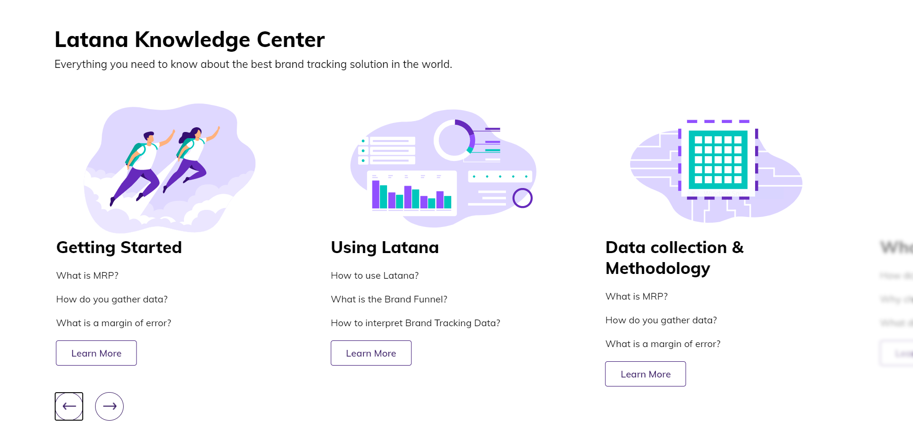

# 'Latana Knowledge Center' Carousel

Carousel built with HTML, CSS, and JavaScript, using React framework.

Depending on the size of the screen, there are 1, 2, or 3 cards visible.
Clicking on the arrows will move the cards left or right. After the last card, the first card will be displayed when clicking the right arrow which will give the impression of the carousel moving infinitely.

The carousel is responsive.

This project was bootstrapped with [Create React App](https://github.com/facebook/create-react-app).

## Available Scripts

In the project directory, you can run:

### `yarn start`

Runs the app in the development mode.\
Open [http://localhost:3000](http://localhost:3000) to view it in the browser.
